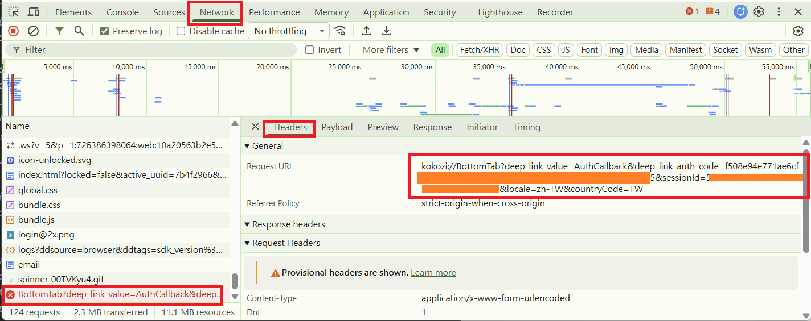
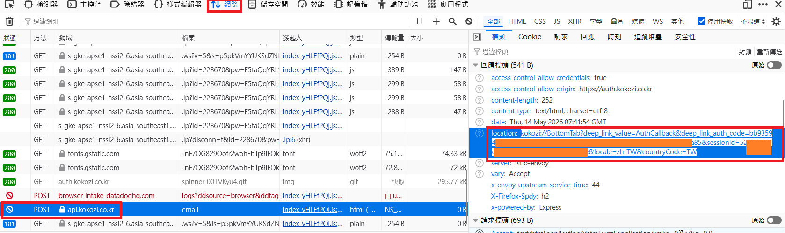

Kokozi House for HomeAssistant
---
### Feature
* Select song from Arti.
* Volume control
* Play/Stop/Next/Previous
* LED brightness control

### Install integration
* Go to HACS from the side bar.
* Click the 3-dot menu in the top right and select Custom repositories
* In the UI that opens, copy and paste the url of this repo link into the `Repository` field.
* Set the category to `Integration`.
* Click `Add`.

### Add integration and Login
* Go to Settings and click `Devices & Integrations`
* Click `+ Add Integration` on the right bottom side.
* Select `Kokozi`
* Select the login method according to your account.
* Click the Link in the dialog.
* In popup browser, press `F12` on your keyboard, DevTools will popup.
* In DevTools, select `Network` and login with your account in web page.
* Now, the webpage will hang, go to DevTools
    * For Chrome
        * Select the entry with `BottomTab`, then click `Header` page on the right side
        * Copy ALL TEXT in `Request URL`
        * Paste them to Setup in HomeAssistant dialog.

    * For Firefox
        * Select entry with `POST` and `api.kokozi.co.kr`
        * In `Response Headers` on the right side, copy ALL TEXT in `location`
        * Paste them to Setup in HomeAssistant dialog.

    * The text will start with `kokozi:`
* Click `Submit` in HomeAssistant

